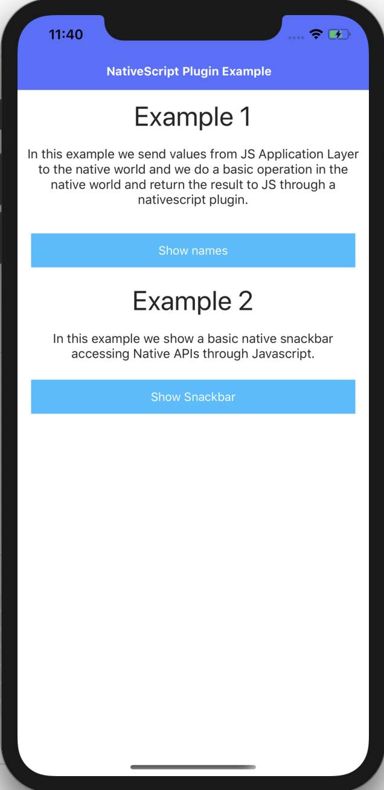

# Accessing native API throught JS

## Demo app

If you want a quickstart, clone the repo, then:

```javascript
$ git clone https://github.com/salvadorcoronel/ns-accessing-native-api.git
$ cd ns-accessing-native-api/src
$ npm run demo-angular.ios
$ npm run demo-angular.android
```

## Example 1:
In this example we send values from JS Application Layer to the native world and we do a basic operation in the native world and return the result to JS through a nativescript plugin.

## Example 2:
In this example we show a basic native snackbar accessing Native APIs through Javascript.  


<br>



